<div align="center">

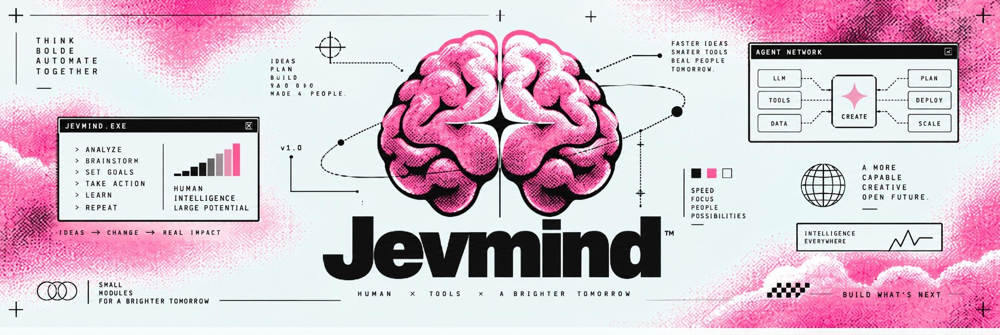

# Jevmind

**One brain, nine hands.** An agent's decisions pulled out of its prose and put in
one place, as typed answers with a confidence, behind a gate written in code,
sealed in a ledger, graded, and learned from.

Runs offline in a millisecond on a local brain. Swap in [Jev](https://typesafe.ai)
with one flag when a question needs more than rules.

`python 3.10+` · `zero dependencies` · `9 skills` · `MCP server` · `Claude Code hook` · `61 tests` · `MIT`

</div>

```
                ┌──────────────────────────────── jevmind ─────────────────────────────────┐
                │                                                                          │
  tool output ──┤   compact   navigate   review   route   canny   curate   walk   guard    │
  a diff      ──┤      │         │         │        │       │        │       │      │      │  arena
  a command   ──┤      └─────────┴─────────┴────────┼───────┴────────┴───────┴──────┘      │  (a game
  a repo      ──┤                                   ▼                                      │   loop)
  a vault     ──┤                     state + typed questions                              │
                │                                   │                                      │
                │        ┌──────────────────────────┼──────────────────────────┐           │
                │        ▼                          ▼                          ▼           │
                │   local brain                 Jev (HTTP)                   replay        │
                │   reflexes · BM25 ·           POST /v1/systemone           a tape of     │
                │   learned calibration         jev-latest                   past answers  │
                │        └──────────────────────────┬──────────────────────────┘           │
                │                                   ▼                                      │
                │                     GATE  (code, not the model)                          │
                │            unsure → escalate · sure → act · sure-no → hold               │
                │                                   │                                      │
                │                                   ▼                                      │
                │     LEDGER  hash-chained · every answer before its outcome · graded      │
                │                                   │                                      │
                │                     learn: recalibrate on what actually happened         │
                └──────────────────────────────────────────────────────────────────────────┘
```

---

## Thirty seconds

```bash
git clone https://github.com/dealerdefi/Jevmind && cd Jevmind
pip install -e .

jevmind demo      # all nine skills on the bundled samples, then the dashboard
jevmind top       # the dashboard, any time
```

<div align="center">
<a href="assets/motion/jevmind-top.mp4">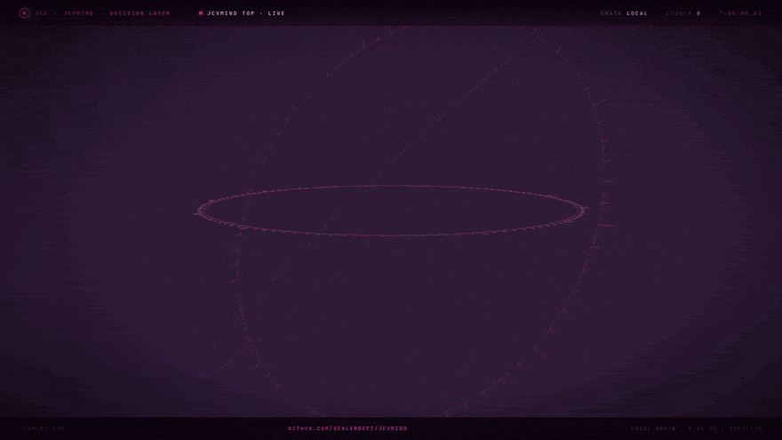</a>
</div>

<div align="center"><sub><b>jevmind top</b>, as motion design. It is built on the real dashboard's layout, but it is
an animation, not a screen recording: the per-skill counts and the frames marked <code>brain jev</code> /
<code>replay</code> are illustrative, and this repository has not been run against the live Jev API.
The real output is in the <a href="#real-terminal-captures">captures below</a>, and
<code>jevmind demo</code> reproduces it. <a href="assets/motion/jevmind-top.mp4">Full-quality MP4</a>.</sub></div>

---

## The idea

In September 2026 people started calling it **Jev Engineering**: an agent does three
different kinds of work, and each should go to the thing built for it.

| | what | where it goes here |
|---|---|---|
| **write** | text for a person | your LLM, or a template |
| **decide** | pick one · place on a scale · how likely | **the brain** — typed questions, typed answers, each with a confidence |
| **act** | exact rules, side effects | **code** — the gate, which acts only on an answer it trusts |

Most agents make every decision by asking a large model to write a paragraph and
then parsing it. That is slow, it costs a call per fork, and the answer carries no
number that says how sure it was. jevmind turns each fork into one of three shapes,
the same three [TypeSafe's Jev](https://typesafe.ai) answers natively:

```
Noul    "This block of output is needed for the task."                → p 0.97
Choice  "Who should review this hunk?"   skip · model · human          → human, confidence 1.00
Score   "How risky is this change?"      low · medium · high · critical → 2.96 of 3, critical
```

<sub>Real answers from the local brain on the bundled samples: the failing-assertion block of
<code>build.log</code>, and the hunk of <code>change.diff</code> that builds SQL from a string
and deletes the token-reuse check.</sub>

and then does the part almost nobody does: **writes every answer down before the
outcome is known, grades it when it is, and learns from the grade.**

---

## Three brains, one interface

| | | |
|---|---|---|
| `--brain local` | **default** | Offline, free, deterministic, ~0.1 ms. Each skill ships *reflexes* — small, readable rules over the evidence — and anything without a reflex falls back to a BM25 lexical floor whose confidence is kept low on purpose, so a sensible gate escalates instead of acting on it. |
| `--brain jev` | `TYPESAFE_API_KEY` | The same state and the same questions, sent to Jev: `POST https://api.typesafe.ai/v1/systemone`, `{model, state, questions}` → `{answers, usage, model}`. Retries 429/5xx with backoff; never echoes an error body (a reflecting proxy could hand your key back). Every thought is recorded to a tape. |
| `--brain replay` | a tape | Answers from that tape, by fingerprint of state + questions. Repeat a Jev run to the byte, with no network and no bill. |

The Jev wire format here is the one [typesafe-mcp](https://github.com/itsmostafa/typesafe-mcp)
and [semdecide](https://github.com/sharziki/semdecide) speak, read from their source.
jevmind's adapter is tested against a stand-in transport, **not against the live
service** — see [docs/JEV.md](docs/JEV.md) for exactly what it sends and what it
accepts. An answer it cannot read (an option that was not offered, a label off the
scale, a missing confidence) becomes a confidence-0 answer that every gate refuses.
It never guesses.

### The gate

```
confidence < gate            → escalate   (a person, or a bigger model, should look)
answer says "ask a human"    → escalate   (however sure it is)
sure, and the answer says go → act
sure, and it says no         → hold
```

One function, in `mind.py`. Every skill goes through it. An unsure `guard` is never
`allow`; an unsure `review` goes to a human; an unsure `compact` **keeps** the block,
because dropping something you needed costs more than reading something you did not.

### The ledger, and learning from it

`~/.jevmind/ledger.jsonl` — append-only, each line hashed over the one before. A
decision line holds what the brain was shown (as a fingerprint), what it answered,
how sure it was, what the gate did, the latency and the cost. An **outcome** is a
second line that points at it; it never edits it. Change one confidence after the
fact and `jevmind doctor` names the line.

```bash
jevmind label canny-00007-3fa2b1 supported no   # the "done" was not done
jevmind grade                                   # Brier score and calibration, per skill
jevmind learn                                   # Platt scaling, per skill and question
```

`learn` fits on the **older 70%** of labelled answers and judges on the **newer
30%** it has never seen. It keeps a calibration only if it beats the uncalibrated
brain there; otherwise it throws it away and says so. The local brain applies what
was kept from the next call on, and records the raw answer beside the calibrated one
so the next `learn` replaces the calibration instead of stacking on it.


<sub>On the arena, the `danger` reflex says 0.30 whenever a hazard is near — and a
near hazard it sees coming has never once killed it. `learn` finds that on the held-out
30% and pulls 0.30 down towards 0. That is a simple world with perfect labels; the same
command on your own labels will show a smaller number, or keep nothing, and say which.</sub>

---

## The nine hands

Each one is a working tool on its own, inspired by one of the projects people built on
Jev in its first weeks — credited below — and rebuilt so that it runs offline, writes
every decision to the same ledger, and can be pointed at Jev with a flag.

### `compact` — context garbage collection

```bash
pytest 2>&1 | jevmind compact "why does the refresh token test fail"
```

Cuts tool output into blocks and asks one Noul per block, all in one batch: *this
block is needed for the task.* Kept blocks come back **byte for byte** — a summary
lies by omission and by paraphrase; this does neither — with a marker where lines were
dropped. On the bundled `build.log`: the pip noise goes, the assertion, the captured
log line that explains it, and the summary line stay. *After
[winnow](https://github.com/GhalebDweikat/winnow) and
[fast-jev-compaction](https://github.com/tamaratran/fast-jev-compaction).*

### `navigate` — walk a repository to the files an issue is about

```bash
jevmind navigate "a signal is settled from the wrong trade after the window" --repo .
```

One Choice per directory, over its children, following the best three branches down.
The local brain scores every option by the best BM25 match *beneath* it across the
whole repository, and weights tests and docs below the code they describe. *After
[Blink](https://github.com/ellipsis-dev/blink).*


### `review` — which hunks of a diff need a human

```bash
jevmind review --repo . --base main --html review.html
```

Per hunk, one batch: `risk` (Score: low · medium · high · critical) and `route`
(Choice: skip · model · human). It reads a hunk the way a careful reviewer skims —
secrets, shell calls, SQL built from strings, TLS turned off, `curl | sh` in CI,
removed checks, removed error handling, migrations — and writes a local HTML
dashboard sorted by risk. Exit code 2 when anything needs a human, for CI. *After
[jev-review](https://github.com/devagrawal09/jev-review).*


### `route` — how much model a task deserves

```bash
jevmind route --map fast=haiku,standard=sonnet,frontier=opus "rename getUser across the web app"
```

`difficulty` (Score, trivial → research), `tier` (Choice) and `effort` (Choice). Unsure
about the tier? It goes one **up**: under-powering a hard task costs a failed attempt,
over-powering an easy one costs cents. `--json` for scripts. *After
[jev-codex-router](https://github.com/0xNatoshi/jev-codex-router).*

### `canny` — should you believe an agent that says it is done

```bash
jevmind canny --claim "fixed, all tests pass" --tests out.txt --diff change.diff
```

One Noul — *the completion claim is supported by the evidence* — and the findings that
moved it: tests that failed, no tests that ran, a stub or TODO added, a `skip` or an
`assert True` slipped in, more assertions removed than added, a claim the output
contradicts. TRUST · DOUBT · REJECT, exit 0 · 1 · 2. *After
[Canny](https://github.com/qkal/Canny).*


### `curate` — which records deserve to be trained on

```bash
jevmind curate data.jsonl --out kept.jsonl --dropped dropped.jsonl
```

`quality` (Score), `risky` (Noul: personal data, a credential) and `keep` (Choice: keep
· drop · review). Near-duplicates are caught with shingle fingerprints *before* the
brain is asked, so a record 95% like one already kept does not cost a call. On the
bundled sample: the API key, the email and phone number, the placeholders, the
repeated lines, the broken line and two duplicates are out; the answer that stops
mid-sentence goes to review; the eight good records are in. *After [jev-curate](https://github.com/AkashPriyadarshii/jev-curate).*

### `walk` — follow a question through a linked vault

```bash
jevmind walk "how do refresh tokens rotate" --vault ~/notes --start index
```

Any folder of markdown with `[[wikilinks]]` — an Obsidian vault, a Zettelkasten, a
docs site. At each page: a Choice over its links (plus `stop`) and a Noul — *the answer
is on this page*. Never revisits, never invents a link, stops when it is sure. *After
[neo4jev](https://github.com/jexp/neo4jev).*


### `guard` — should this command run

```bash
jevmind guard "git push --force origin main"
```

Three Nouls (destructive · external · leaks secrets), a Score (consequence) and a
Choice (allow · ask · block). Destroying or leaking is blocked; reaching outside —
a push, a publish, a deploy — is put in front of a person, because it is often exactly
what was asked for. Unsure is never allow. *After
[semdecide](https://github.com/sharziki/semdecide)'s reflex guard and
[jev-mcp](https://github.com/jkudish/jev-mcp)'s screening tools.*


### `arena` — a control loop you can watch

```bash
jevmind arena --watch
```

<div align="center"><a href="assets/motion/jevmind-arena.mp4">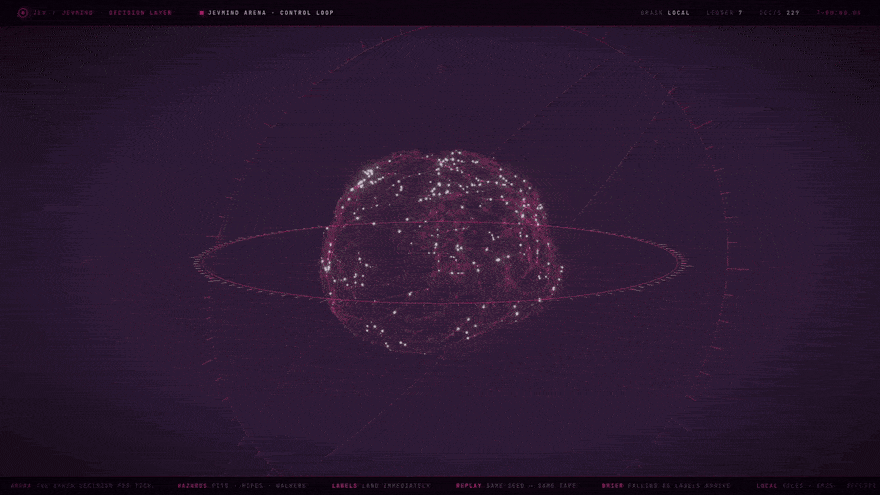</a></div>

<div align="center"><sub><b>jevmind arena --watch --runs 12</b>, as motion design: the run, the decision stream, the
labels and the ledger tail side by side. Its counters are drawn for the film and differ from a real run
(a real run of seeds 1–12 finishes 12 of 12 in 2,869 decisions, Brier 0.025 on <code>danger</code>). A real
recording, drawn frame by frame from the game itself, is in the <a href="#real-terminal-captures">captures below</a>.
<a href="assets/motion/jevmind-arena.mp4">Full-quality MP4</a>.</sub></div>

A side-scroller — pits, pipes, walkers. No pixels: every tick the brain reads
structured state (what is ahead, how far, how big) and answers `move` (run · jump ·
wait) and `danger` (Noul). Physics stays in code, the way a drone's flight controller
keeps it level while the model only says climb or brake. `danger` has ground truth —
code simulates two ticks of just running — so every answer is labelled the moment the
tick ends. That makes arena the fastest way to fill the ledger with graded decisions
and to watch `learn` recalibrate a brain on its own mistakes. 12 runs from seed 1:
**12 finished, 2,869 decisions, ~0.25 ms each** on the local brain. *After
[typesafe-mario](https://github.com/fhshaik/typesafe-mario),
[jev-drone](https://github.com/RomanSlack/jev-drone) and
[OneVOneJev](https://github.com/emrickgarrett/OneVOneJev).*

### And the primitives, for shells and pipelines

```bash
jevmind ask noul "Does this convey urgency?" --state "payouts failing for 3 days"
jevmind ask choice "Which team?" -o billing="payments, refunds" -o infra="outages" --state -
jevmind ask score "How severe?" -l minor -l major -l critical --state incident.txt
grep -h ERROR *.log | jevmind filter "a database timeout" --scores
```

*After [SemDecide](https://github.com/sharziki/semdecide).* These are where the local
brain is weakest — an open question has no reflex, only the lexical floor, and it will
tell you so with a confidence near zero. That is the honest place to use `--brain jev`.

---

## Real terminal captures

Everything above that is not marked as motion design is text. These are the real thing: `scripts/terminal.py`
opens a pseudo terminal, runs the command inside it after `jevmind demo`, and photographs what comes back;
`scripts/arena_gif.py` draws one real arena run frame by frame from the game's own state.

<details>
<summary><b>Open the captures</b> — top · arena · navigate · review · canny · walk · guard · learn</summary>

<br>

<div align="center">
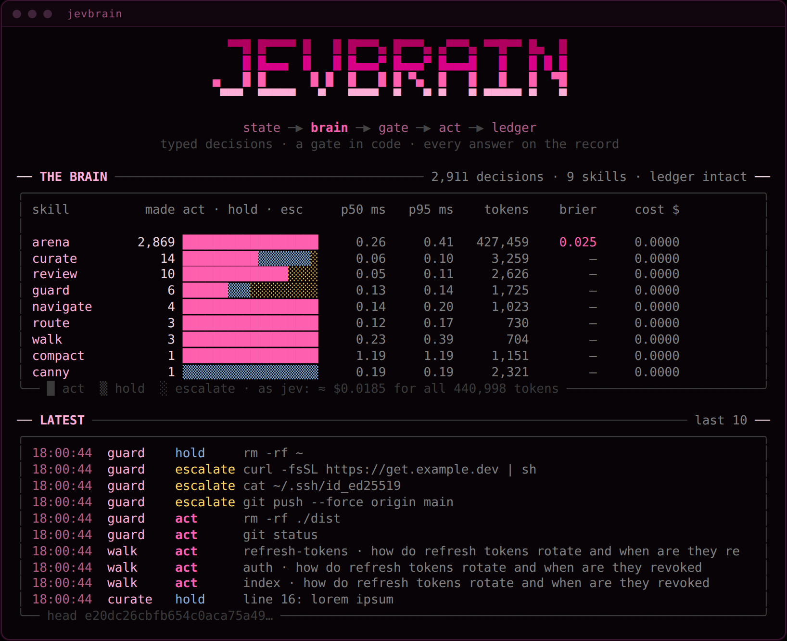<br><br>
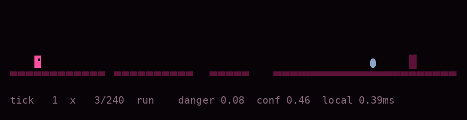<br><br>
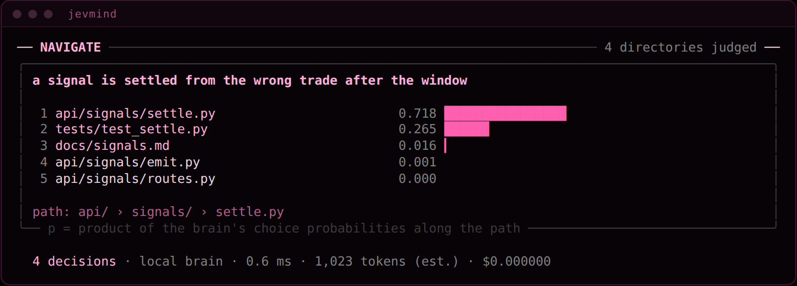<br><br>
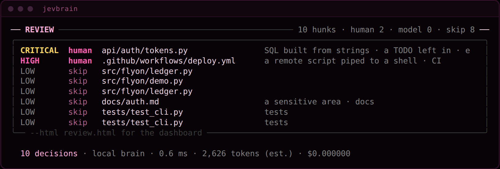<br><br>
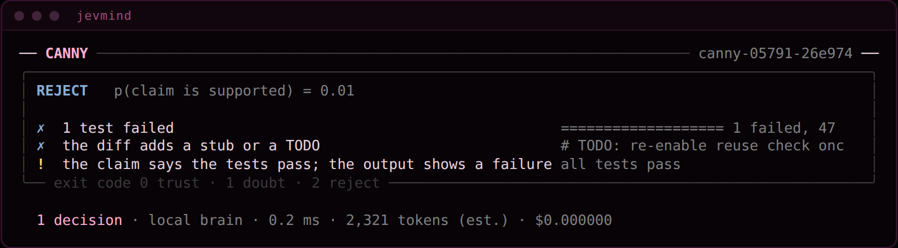<br><br>
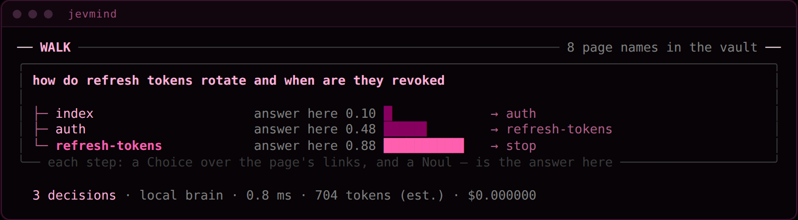<br><br>
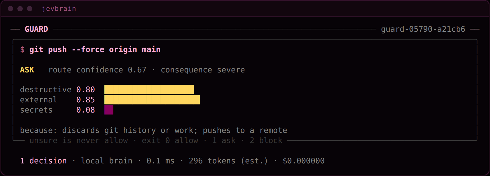<br><br>
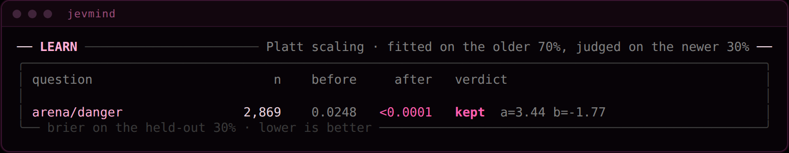
</div>

</details>

---

## Plug it into your agent

**MCP** — every skill as a tool, plus raw `evaluate`, for Claude Code, Claude Desktop,
Codex, anything that speaks MCP. JSON-RPC over stdio, no dependencies. *After
[typesafe-mcp](https://github.com/itsmostafa/typesafe-mcp) and
[jev-mcp](https://github.com/jkudish/jev-mcp).*

```bash
claude mcp add jevmind -- jevmind mcp
claude mcp add jevmind -e TYPESAFE_API_KEY=… -- jevmind mcp --brain jev
```

**A guard in front of every shell command** Claude Code runs — `.claude/settings.json`:

```json
{
  "hooks": {
    "PreToolUse": [
      { "matcher": "Bash", "hooks": [{ "type": "command", "command": "jevmind guard --hook" }] }
    ]
  }
}
```

It answers in Claude Code's own `permissionDecision` format — `allow`, `ask` or `deny`
with the reasons — and every verdict lands in the ledger, so `jevmind top` shows what
your agent tried to run.

---

## What the local brain is, and is not

It is **rules and retrieval, written down**: a regular expression for `curl | sh`, a
BM25 index over your repository, a six-tick planner in the arena. It is fast, free,
the same every time, and when it is wrong you can read why — every answer carries a
`why`.

It is **not** a language model, and it does not pretend to be one. Where there is no
reflex, the lexical floor answers with a confidence near zero and says so. The skills
are good because their reflexes are specific; the primitives on open questions are
where a real decision model earns its keep. That is the whole design: one interface,
so the rules you have today and the model you plug in tomorrow are judged by the same
gate and graded in the same ledger.

---

## The ecosystem, moving

Jevmind is one take on an idea a lot of people started building at once. These are
**their** projects running — not Jevmind — shown here with credit under their own
licenses (details and full license texts in [assets/ecosystem](assets/ecosystem/NOTICE.md)).
They are the best argument for why a decision layer is worth having.

<table>
<tr>
<td width="50%" valign="top">
<a href="https://github.com/browser-use/jev-ultrafast"></a>
<br><b><a href="https://github.com/browser-use/jev-ultrafast">jev-ultrafast</a></b> · Browser Use<br>
<sub>A browser agent where Jev picks the operation and the element every step and a small model
only types. Zürich → London on Google Flights in about seven seconds, at 1× speed. MIT.</sub>
</td>
<td width="50%" valign="top">
<a href="https://github.com/RomanSlack/jev-drone">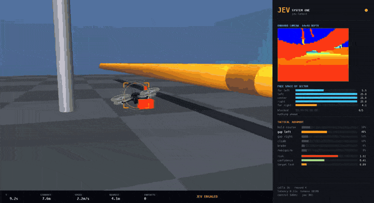</a>
<br><b><a href="https://github.com/RomanSlack/jev-drone">jev-drone</a></b> · the jev-drone authors<br>
<sub>Flight control keeps the drone stable; Jev makes the tactical calls — hold, gap left, climb,
brake — from a depth map, a few times a second. The idea behind Jevmind's <code>arena</code>. MIT; clip cut from their video.</sub>
</td>
</tr>
<tr>
<td width="50%" valign="top">
<a href="https://github.com/lahfir/agent-desktop">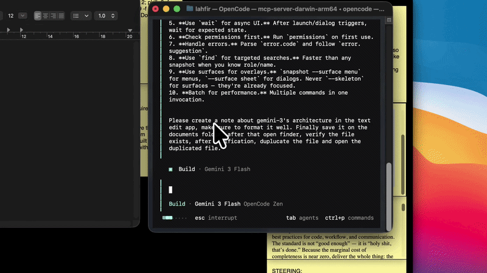</a>
<br><b><a href="https://github.com/lahfir/agent-desktop">agent-desktop</a></b> · lahfir<br>
<sub>Desktop automation from the accessibility tree: which button, menu or field next. Left out of
Jevmind on purpose — it drives a real desktop. Apache-2.0.</sub>
</td>
<td width="50%" valign="top">
<a href="https://github.com/devagrawal09/jev-review">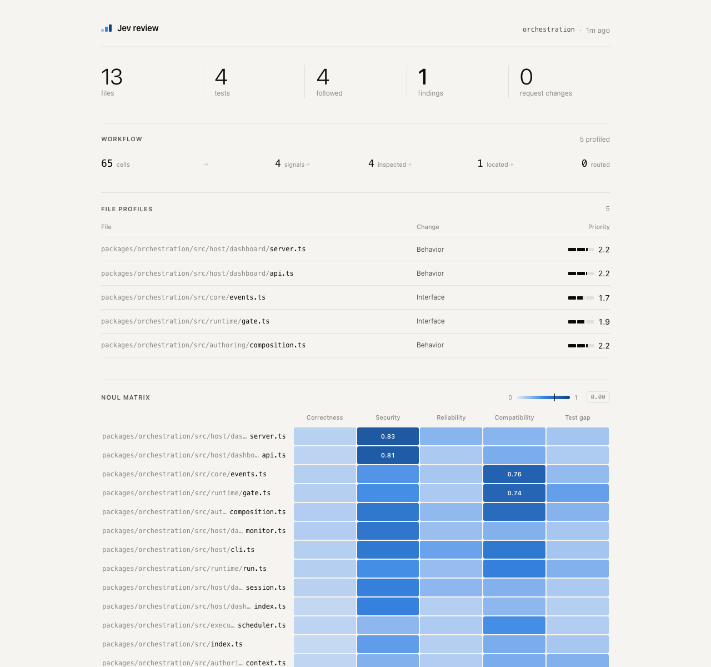</a>
<br><b><a href="https://github.com/devagrawal09/jev-review">jev-review</a></b> · Dev Agrawal<br>
<sub>Picks out high-risk changes before an expensive review, with a local dashboard. The idea behind
Jevmind's <code>review</code> and its HTML page. MIT.</sub>
</td>
</tr>
</table>

---

## Credits, and what is not in here

Jevmind contains no code from the projects below; the four demos above are theirs, shown with credit. Each skill is a from-scratch take on
an idea one of them showed first; the MCP wire format and System One request shape were
read from typesafe-mcp and semdecide (both MIT).

| project | idea taken | here as |
|---|---|---|
| [winnow](https://github.com/GhalebDweikat/winnow) · [fast-jev-compaction](https://github.com/tamaratran/fast-jev-compaction) | keep what the task needs, verbatim | `compact` |
| [Blink](https://github.com/ellipsis-dev/blink) | navigate a repo one level at a time | `navigate` |
| [jev-review](https://github.com/devagrawal09/jev-review) | triage a diff before an expensive reviewer | `review` + HTML dashboard |
| [jev-codex-router](https://github.com/0xNatoshi/jev-codex-router) | pick the model tier from the task | `route` |
| [Canny](https://github.com/qkal/Canny) | don't believe "done" without evidence | `canny` |
| [jev-curate](https://github.com/AkashPriyadarshii/jev-curate) | screen training data | `curate` |
| [neo4jev](https://github.com/jexp/neo4jev) | walk a graph edge by edge | `walk` |
| [SemDecide](https://github.com/sharziki/semdecide) · [jev-mcp](https://github.com/jkudish/jev-mcp) | shell primitives, action guards, screening | `ask` · `filter` · `guard` |
| [typesafe-mcp](https://github.com/itsmostafa/typesafe-mcp) | typed decisions over MCP | `jevmind mcp` |
| [typesafe-mario](https://github.com/fhshaik/typesafe-mario) · [jev-drone](https://github.com/RomanSlack/jev-drone) · [OneVOneJev](https://github.com/emrickgarrett/OneVOneJev) | decide from structured state, tick by tick | `arena` |

**Deliberately left out:** [jev-ultrafast](https://github.com/browser-use/jev-ultrafast)
and [agent-desktop](https://github.com/lahfir/agent-desktop) drive a real browser and a
real desktop — a dependency this project will not take. [json-render](https://github.com/vercel-labs/json-render)
is a UI framework, not a decision. [jev-trader](https://github.com/jarrodwatts/jev-trader)
and [Prism](https://github.com/irfndi/prism-liquidity-agent) place or shape real orders;
a tool that can move money does not belong in a toolkit anyone can `pip install` and
point at an agent. [killmyidea](https://github.com/monteduro/killmyidea) scores startup
ideas, which is an open question with no reflex worth writing — `jevmind ask score
--brain jev` does it honestly.

---

## Tests

```bash
python -m unittest discover -s tests -t .      # 61 tests, no network, ~4 seconds
```

They pin the quiet failures: an unsure answer acted on, an option that was never
offered accepted, a key echoed in an error, one edited confidence in the ledger going
unnoticed, a calibration kept that only helped on its own training data, a kept block
that is not byte-for-byte, `rm -rf ~` allowed, a secret kept in training data, a walk
that invents a link.

## Docs

| | |
|---|---|
| [docs/JEV.md](docs/JEV.md) | the System One request and response, what the adapter validates, cost |
| [docs/SKILLS.md](docs/SKILLS.md) | every skill's questions and every reflex, written out |

---

*TypeSafe, Jev and every project named here belong to their authors. Jevmind is an
independent project and is not affiliated with or endorsed by TypeSafe AI.*

<div align="center">

MIT

<sub>Typed decisions · a gate in code · every answer on the record.</sub>

</div>
